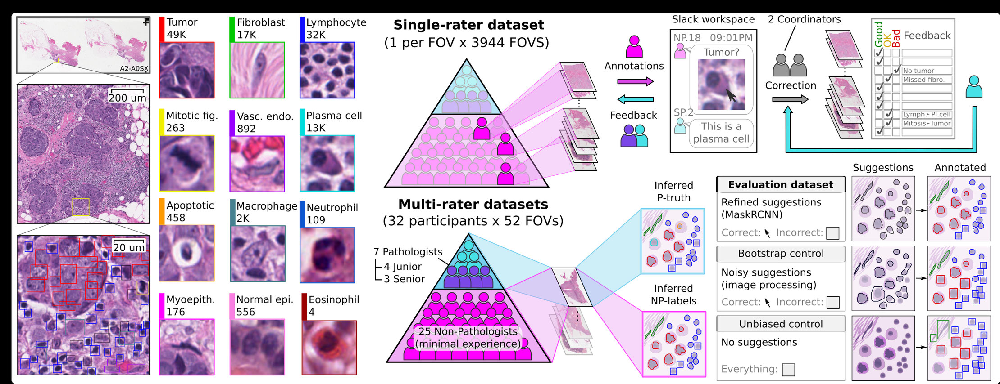
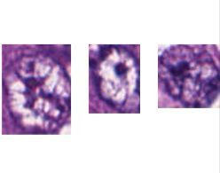
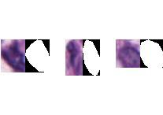

# NuCLS Dataset Organization

This repository contains the organized NuCLS dataset, which is a large-scale dataset for nucleus classification, localization, and segmentation in breast cancer. The dataset has been preprocessed and organized into `train`, `test`, and `val` folders, with separate subfolders for `rgb`, `annotation`, and `mask` data. Additionally, the dataset is further organized for two primary tasks: **Object Detection** and **Semantic Segmentation**.

---
## Citations

If you use this dataset or code in your research, please cite the following papers:
### Task-Ready PanNuke and NuCLS Datasets: Reorganization, Synthetic Data Generation, and Experimental Evaluation.

**Koganti, S.C., Yellu, S., Yun, J., & Lee, S.** (2025). Task-Ready PanNuke and NuCLS Datasets: Reorganization, Synthetic Data Generation, and Experimental Evaluation. *IEEE Access*, **13**, 125275–125286. https://doi.org/10.1109/ACCESS.2025.3589477

### NuCLS: A Scalable Crowdsourcing, Deep Learning Approach and Dataset for Nucleus Classification, Localization, and Segmentation

Mohamed Amgad, Lamees A. Atteya, Hagar Hussein, et al.  
**GigaScience**, 11 (2022).  
DOI: [10.1093/gigascience/giac037](https://doi.org/10.1093/gigascience/giac037)  
arXiv: [2102.09099 [eess.IV]](https://doi.org/10.48550/arXiv.2102.09099)

### Structured Crowdsourcing Enables Convolutional Segmentation of Histology Images

Mohamed Amgad, Habiba Elfandy, Hagar Hussein, Lamees A Atteya, Mai A T Elsebaie, et al.  
**Bioinformatics**, Volume 35, Issue 18, September 2019, Pages 3461–3467.  
DOI: [10.1093/bioinformatics/btz083](https://doi.org/10.1093/bioinformatics/btz083)

---

### BibTeX Entries

For convenience, here are the BibTeX entries for inclusion in academic papers:

```bibtex
@article{11080424,
  author={Koganti, Sai Chandana and Yellu, Siri and Yun, Jihoon and Lee, Sanghoon},
  journal={IEEE Access}, 
  title={Task-Ready PanNuke and NuCLS Datasets: Reorganization, Synthetic Data Generation, and Experimental Evaluation}, 
  year={2025},
  volume={13},
  pages={125275-125286},
  doi={10.1109/ACCESS.2025.3589477}
}

@article{amgad2022nucls,
  title={NuCLS: A scalable crowdsourcing, deep learning approach and dataset for nucleus classification, localization and segmentation},
  author={Amgad, Mohamed and Atteya, Lamees A and Hussein, Hagar and others},
  journal={GigaScience},
  volume={11},
  year={2022},
  publisher={Oxford University Press},
  doi={10.1093/gigascience/giac037}
}

@article{amgad2019structured,
  title={Structured crowdsourcing enables convolutional segmentation of histology images},
  author={Amgad, Mohamed and Elfandy, Habiba and Hussein, Hagar and others},
  journal={Bioinformatics},
  volume={35},
  number={18},
  pages={3461--3467},
  year={2019},
  publisher={Oxford University Press},
  doi={10.1093/bioinformatics/btz083}
}
```
## Dataset Overview

The NuCLS dataset contains over 220,000 labeled nuclei from breast cancer images from TCGA. The nuclei were annotated by pathologists, pathology residents, and medical students. 



## Dataset Details

**Source:** [NuCLS Website](https://sites.google.com/view/nucls/home)

### Structure of the Original Dataset

Each dataset folder includes four sub-folders:
- **rgb:** FOV images (`.png`)
- **csv:** Annotation coordinates (`.csv`)
- **mask:** Mask images (`.png`)
- **visualization:** Visualization images (`.png`)

**Image Resolution:** All images are at 0.2 microns-per-pixel.  
**Coordinate Units:** Pixel units at 0.2 microns-per-pixel.

### CSV Annotation File

Each CSV file includes:
- `raw_classification`: Raw cell type (13 total)
- `main_classification`: Nucleus class (7 total)
- `super_classification`: Nucleus superclass (4 total)
- `type`: Annotation type (`rectangle` or `polyline`)
- `xmin`, `ymin`, `xmax`, `ymax`: Bounding box coordinates
- `coords_x`, `coords_y`: Comma-separated polygon boundary coordinates

### Mask Format

- **First channel:** Encodes class labels.
- **Second and third channels:** Their product provides the unique instance label.
- **FOV area:** Represented in gray and included in the class table.

**Note:** Unlike the CSV files, the mask images do not differentiate between bounding boxes and segmentations.


### Key Features
- **13 Cell Types**: Includes tumor, fibroblast, lymphocyte, macrophage, and more.
- **Annotation Types**: Rectangular bounding boxes and polyline masks.
- **Tasks Supported**: Object Detection and Semantic Segmentation.

---

## Dataset Selection and Organization Workflow

### Dataset Selection
The NuCLS dataset provides both **single-rater** and **multi-rater** datasets. For this project:
- **Single-Rater Dataset**: Selected for consistency in annotations.
- **Corrected Single-Rater Dataset**: Chosen to ensure high-quality annotations.
- **Train-Test Split**: Used **folder-1** from the train-test split folder, which includes `fold_1_train.csv` and `fold_1_test.csv`.

### Step 1: Organizing RGB, Annotation, and Mask Folders Based on CSV Files
The dataset was initially organized using the `fold_1_train.csv` and `fold_1_test.csv` files. These CSV files were used to match and organize the `rgb`, `annotation`, and `mask` folders into `train`, `test`, and `val` sets.

The code for this step is available in the file:  
📄 **`data.py`**

After organizing the dataset based on the CSV files, the dataset was structured into `train`, `test`, and `val` folders. Each folder contains the following subfolders:
- **rgb**: Contains the RGB images.
- **annotation**: Contains CSV files with nucleus annotations.
- **mask**: Contains mask images for semantic segmentation.

The folder structure is as follows:

```plaintext
train/
├── rgb/
├── annotation/
└── mask/
test/
├── rgb/
├── annotation/
└── mask/
val/
├── rgb/
├── annotation/
└── mask/
```


### Step 2: Organizing for Object Detection and Semantic Segmentation
The dataset was further organized into two tasks:
1. **Object Detection**: Contains cropped images for nuclei with rectangular annotations. No masks are provided for this task.
2. **Semantic Segmentation**: Contains cropped images and corresponding masks for nuclei with polyline annotations.

The folder structure for these tasks is as follows:

```plaintext
main_organised/
├── object_detection/
│   ├── tumor/
│   │   └── images/  # Cropped nuclei (rectangles)
│   ├── fibroblast/
│   │   └── images/
│   ...
└── semantic_segmentation/
    ├── tumor/
    │   ├── images/  # Cropped nuclei
    │   └── masks/   # Binary polygon masks (0: background, 255: nucleus)
    ├── fibroblast/
    │   ├── images/
    │   └── masks/
    ...

```

The code for this step is available in the file:  
📄 **`organise_main.py`**

---


*Object Detection Images: Tumor*



*Semantic Segmentation Images: Tumor*

## Usage Instructions

### 1. Clone the Repository

```bash
git clone https://github.com/chandana-koganti14/NuCLS-Dataset-Organization.git
cd NuCLS-Dataset-Organization
```

### 2. Install Dependencies
Ensure you have Python installed, then run:

```bash
pip install pandas numpy pillow tqdm
```

### 3. Organize the Dataset

Update the paths in data.py to match your local directory structure. For example:

- **csv_file**: Path to fold_1_train.csv or fold_1_test.csv.
- **rgb_folder**: Path to the folder containing RGB images.
- **annotation_folder**: Path to the folder containing annotation CSV files.
- **mask_folder**: Path to the folder containing mask images.
- **output_folder**: Path to the output folder (e.g., train or test).

```bash
python data.py
```

Update the paths in organise_main.py to match your local directory structure. For example:

- **image_dir**: Path to the rgb folder.
- **mask_dir**: Path to the mask folder.
- **annotation_dir**: Path to the annotation folder.
- **output_dir**: Path to the output folder for organized data.

```bash
python organise_main.py
```
---

## Code Files

The dataset was organized using the following Python scripts:
- 📄 **`data.py`**: Organizes `rgb`, `annotation`, and `mask` folders based on CSV files.
- 📄 **`organise_main.py`**: Further organizes the dataset for Object Detection and Semantic Segmentation.

---

**Additional Notes:**
   - Rectangular masks in some cases output entirely white images. Therefore, two separate datasets (rectangular and polyline) were created to serve object detection and semantic segmentation tasks respectively.
   - A `README.txt` is generated in the output folder summarizing the number of images per tissue type for each task.


